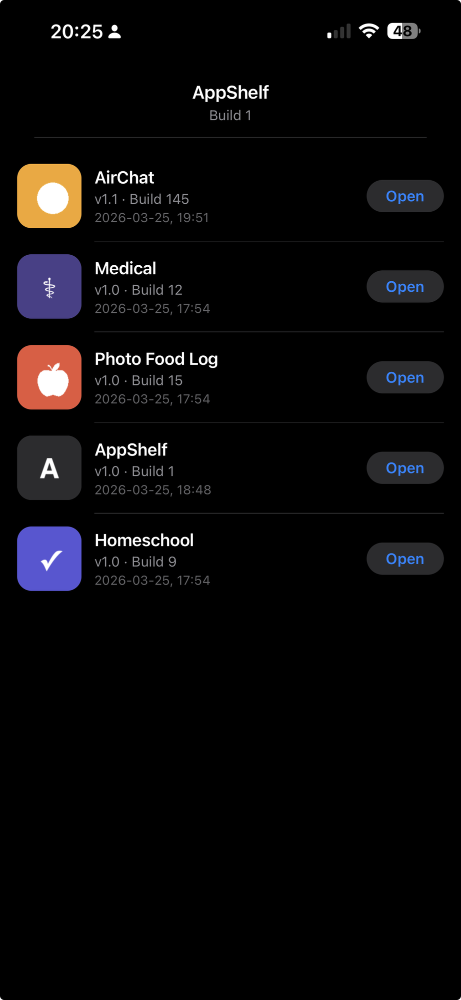
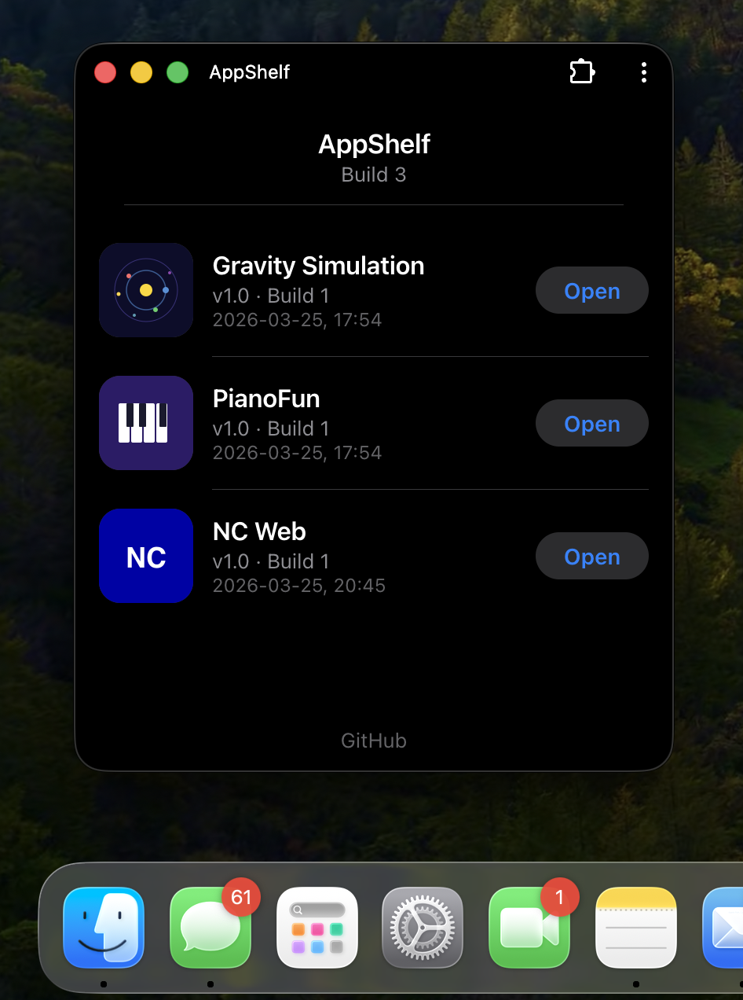

# AppShelf

A personal app catalog for your iPhone — inspired by [Naval's post](https://x.com/naval/status/2036768607074406606) about AI coding agents delivering one-shot custom apps straight to your phone.



## Features

- **Native iOS look** — pure black OLED dark mode, SF fonts, iOS-style rounded icons and pill buttons
- **Personal app catalog** — list your custom-built apps with icons, versions, build numbers, and dates
- **One-tap launch** — Open buttons link to your PWAs, TestFlight builds, websites, or URL schemes
- **Installable PWA** — add to iPhone home screen via Safari, or install as a desktop app via Chrome on Mac/Windows/Linux
- **Offline support** — service worker caches everything, works without internet
- **Pull to refresh** — swipe down to reload the app manifest
- **Zero dependencies** — vanilla JavaScript, no frameworks, no build step
- **Simple manifest** — add or remove apps by editing a single `apps.json` file

## Quick Start

Serve the directory with any static file server:

```bash
# Python
python3 -m http.server 8000

# Node
npx serve .

# PHP
php -S localhost:8000
```

Then open `http://localhost:8000` in your browser.

## Install on iPhone

1. Open the URL in Safari
2. Tap **Share** → **Add to Home Screen**
3. AppShelf appears as a standalone app with its own icon

## Install on Mac / Windows / Linux

1. Open the URL in Chrome
2. Click the **Install** button in the address bar
3. AppShelf installs as a standalone desktop app — no browser chrome, sits in your dock/taskbar



## Adding Apps

Edit `apps.json` to add your apps:

```json
{
  "name": "AppShelf",
  "build": 1,
  "apps": [
    {
      "id": "my-app",
      "name": "My App",
      "version": "1.0",
      "build": 1,
      "date": "2026-03-25, 18:00",
      "icon": "icons/apps/my-app.png",
      "url": "https://my-app.example.com",
      "type": "pwa"
    }
  ]
}
```

Push the change — users get the updated list on next refresh.

## Running Tests

```bash
npm test
```

## Browser Support

Works on iPhone (Safari PWA), Mac/Windows/Linux (Chrome installable PWA), and any modern browser with ES modules and service worker support.

## Blog Post

Read the story behind this project: [Naval Said "Make Your Own App Store" — So I Did](https://victorantos.com/posts/naval-said-make-your-own-app-store-so-i-did/)

## Author

[Victor Antofica](https://victorantos.com)

## License

[GPL-3.0](LICENSE)
